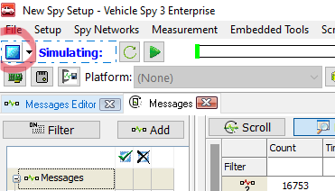
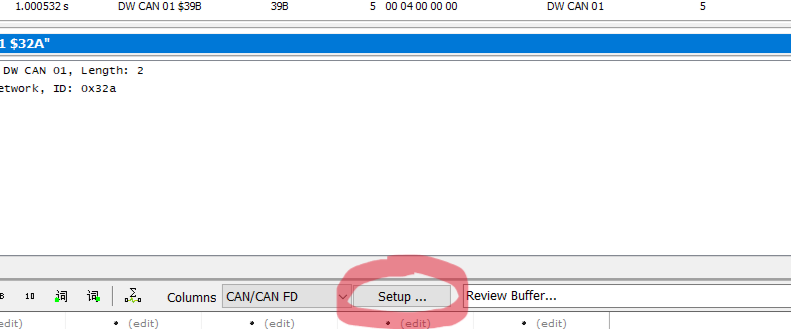
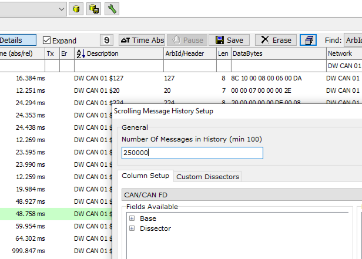
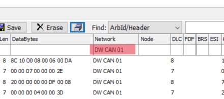

# PandaCANDecoder
A python library for logging and decoding CAN messages using [Comma.ai Pandas](https://github.com/commaai/panda)

### Getting Started
 - Download the necessary dependencies using `setup.py`, in the pandacandecoder-main file
 - A .csv file is stored in pandacandecoder-main/can_data.  This file has been preprocessed and should be ready to work with
 - If you are using new data, a .csv file downloaded directly from VSpy3 can be processed using the `vspy_processing` function with the .csv path as the first argument 
    - Note that when you are downloading data from VSpy3, make sure the buffer has been adjusted to be large enough to contain all of the data.  This can be done by  
          - Clicking the blue stop button on the top left
          

          
          

          - When VSpy is in offline mode, clicking setup at the bottom of the page
          

          
          

          - Increasing the number of messages in history
          

          
          

    - IMPORTANT: Before downloading the .csv from VSpy, select 'DW CAN 01' in the Network box.  If this is not selected the processing time is much longer and the .csv file can be read incorrectly into the Pandas DataFrame
    

    
    

    
 - If the new data has been stored in a pickle file, the `pickle_processing` function should be able to convert the pickle data into a usable.csv format

### pandacandecoder-main

**setup.py**
 - Running `pip install .` within the pandacandecoder-main folder should be enough to install the necessary packages
 - This should be the only setup required

**message_decoder.ipynb**
 - The main file used to find matches for diagnostic signals
 - Likely the only file that you will need to use, unless you need to process VSpy3 data into usable format

**panda_preprocessing.py**
 - Accepts a .csv file downloaded from VSpy3 and converts it to correct format
 - Also contains a function to create separate .csv files for distinct message IDs

**PandaCANDecoder**
 - Contains .py files that `message_decoder.ipynb` uses to decode the CAN message data

**can_data**
 - Contains .csv file with CAN messages from the ScionIQ
 - Folder fills up with new .csv files created as `message_decoder.ipynb` is run

**diagnostic_signal.py**
 - Stores information about the diagnostic signals that we know and want to find matches for
